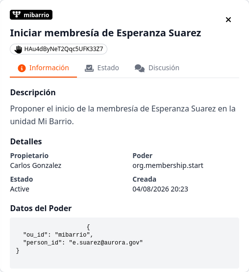
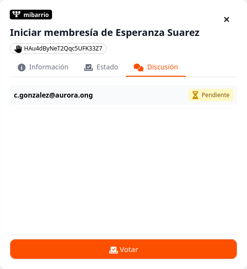
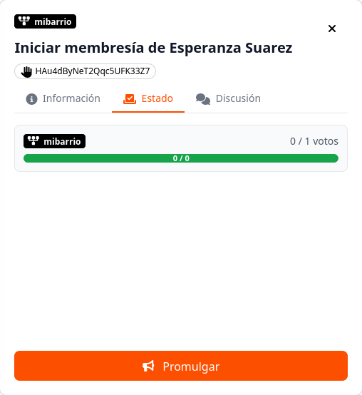

# ¿Cómo crear y gestionar una propuesta?

En AuroraGov, cualquier decisión formal que afecte la estructura, roles o miembros de una comunidad debe canalizarse mediante una **Propuesta**.

---

## 1. Crear y Publicar una Propuesta

Para iniciar un proceso de decisión dentro de la organización:

1. Haz clic en el botón de acceso rápido **Gobernar** ubicado en la parte superior derecha. 

2. Selecciona la **Unidad de Origen** y la **Unidad Destino** donde aplicará la medida.
3. Elige la **Acción** a ejecutar (*ej. Iniciar membresía, Crear rol, Crear unidad organizacional*).
4. Completa los campos específicos requeridos según la acción seleccionada.
5. Ingrese el **Título propuesta** y la **Descripción propuesta** detallando los motivos de la solicitud.
6. Haz clic en **Revisar** para validar que los datos sean correctos.
7. Marca la opción **Utilizar poder delegado** si corresponde y presiona **Publicar**.

---

## 2. Gestión y Detección de Estado de la Propuesta

Una vez publicada, el sistema te redirigirá a la pantalla principal del módulo **Propuestas**. Al seleccionar una propuesta de la lista, el panel lateral derecho permite gestionar su ciclo de vida mediante tres pestañas:

### Pestaña Información
Consulta los metadatos generales de la solicitud:
* **Identificador único** de la propuesta.
* **Unidad de Origen** y **Unidad Destino**.
* **Acción solicitada** y usuario responsable de la publicación.

### Pestaña Discusión
Es el espacio de debate y participación directa:
* Visualiza los comentarios e intervenciones de los miembros.
* Permite emitir, modificar o ajustar tu voto (**A favor**, **En contra**, **Abstención**).

### Pestaña Estado
Monitorea el avance del consenso comunitario:
* **Barra de Quórum:** Muestra la relación entre los votos emitidos y los requeridos según la postura colectiva.
* **Promulgación:** Habilita el botón **📢 Promulgar** cuando se han cumplido las condiciones de aprobación para aplicar formalmente la decisión en la plataforma.

