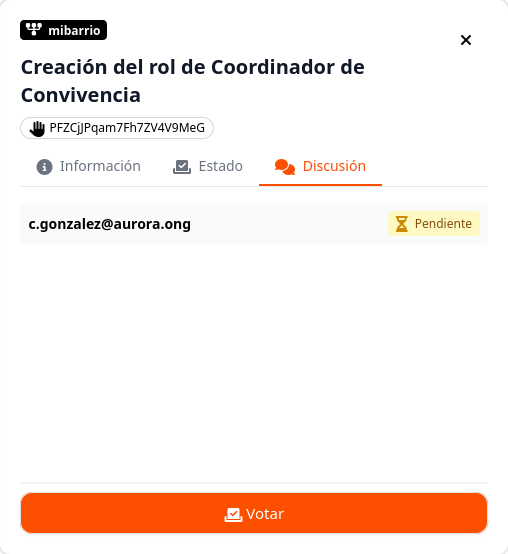
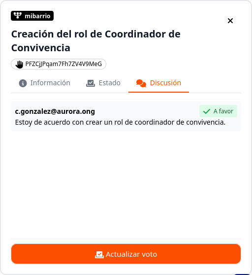
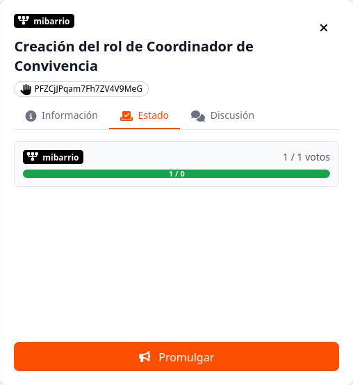
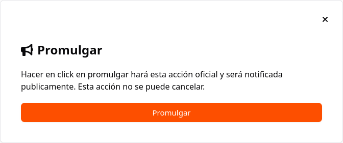

# ¿Cómo emitir un voto o postura?

En AuroraGov la participación se gestiona en dos niveles: configurando el porcentaje de exigencia individual (**Postura**) dentro del Módulo de Poder para delegar, o votando directamente las propuestas activas en el **Módulo de Propuestas**.

---

## 1. ¿Cómo votar directamente en una propuesta?

El voto directo sobre las decisiones de la comunidad se realiza exclusivamente desde la sección de propuestas:

1. En el menú lateral izquierdo, selecciona la opción **Propuestas**.
2. En la lista principal, ubica la propuesta activa en la que deseas participar y haz clic sobre ella para seleccionarla.
3. En el panel lateral derecho que se despliega, haz clic en la pestaña **Discusión**.
4. En la parte inferior del panel lateral, haz clic en el botón naranja **📩 Votar**.

5. Selecciona el sentido de tu voto (**A favor**, **En contra** o **Abstención**), agrega un comentario o argumento si lo deseas y confirma tu decisión.

---

## 2. Modificar un voto emitido

Si cambias de opinión antes de que finalice el periodo de votación, puedes actualizar tu registro:

1. Ingresa a la pestaña **Discusión** de la propuesta correspondiente.
2. En la parte inferior, verás tu estado actual marcado (ej. *A favor*). Haz clic en el botón naranja **📩 Actualizar voto**.
3. Selecciona tu nueva postura, ajusta tus argumentos y confirma la actualización.

---

## 3. Promulgar una propuesta aprobada

Una vez que la propuesta alcanza el quórum y la participación requerida, el paso final para hacerla efectiva en el sistema es la promulgación:

1. En el panel lateral derecho de la propuesta, haz clic en la pestaña **Estado**.
2. Verifica la barra de avance de votos para confirmar que se alcanzó el objetivo.
3. En la parte inferior, haz clic en el botón naranja **📢 Promulgar**.

Al promulgar, la acción vinculada a la propuesta (*ej. crear rol, iniciar membresía, etc.*) se ejecutará automáticamente en la plataforma.

