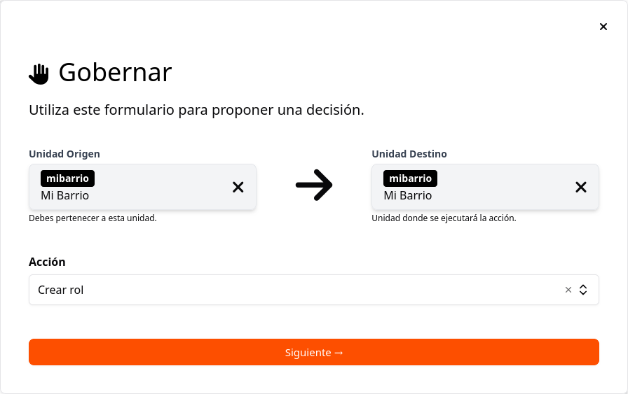
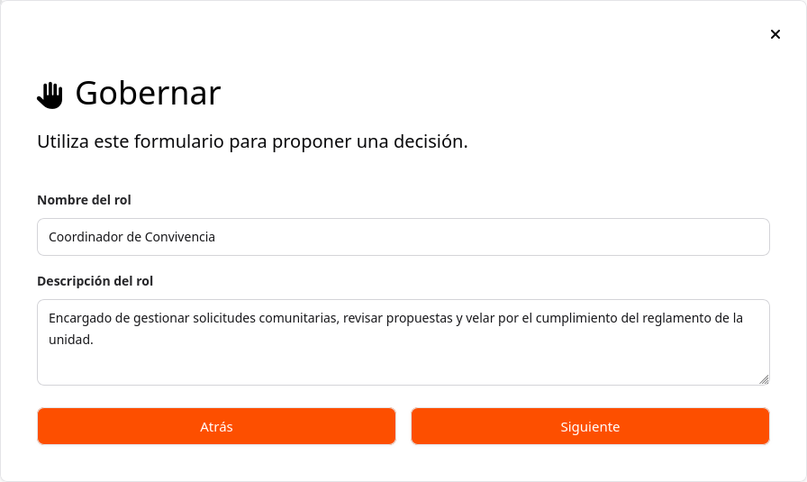
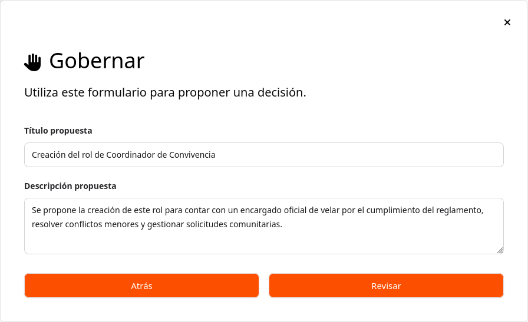
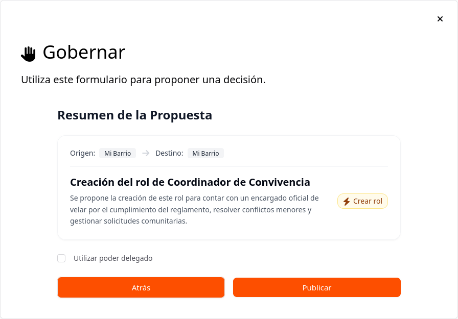

# Estructura Organizacional y Gobierno

Una vez iniciada la sesión, se pueden realizar acciones individuales y colectivas utilizando el menú lateral izquierdo. Para agilizar los procesos de gobernanza, la plataforma cuenta con el botón de acceso rápido **Gobernar**.

Al presionar **Gobernar**, se despliega el formulario principal de creación de propuestas:

---

### Configuración General de la Propuesta

1. **Unidad de Origen:** Selecciona la unidad desde donde emites la propuesta.
2. **Unidad Destino:** Selecciona la unidad donde se ejecutará la acción.
3. **Acción:** Selecciona la actividad según el tipo de decisión requerida.

Las acciones disponibles en el sistema son:
* Iniciar membresía
* Crear unidad organizacional
* Promover membresía
* Asignar rol
* Designar rol
* Archivar rol

---

## Guías Paso a Paso

<b>📘 ¿Cómo crear una unidad organizacional?</b>

1. Selecciona la **Unidad de Origen** y la **Unidad Destino**.
2. En el campo **Acción**, selecciona **Crear unidad organizacional** y haz clic en **Siguiente**.

3. Diligencia los datos de la nueva unidad:
   * **Identificador de la unidad:** Código o ID único del nuevo espacio.
   * **Nombre de la unidad:** Nombre público de identificación.
   * **Objetivo de la unidad:** Propósito o finalidad general.
   * **Descripción de la unidad:** Detalles sobre sus funciones o alcance.

4. Haz clic en **Siguiente** e ingresa la información de la propuesta comunitaria:
   * **Título de la propuesta.**
   * **Descripción de la propuesta.**

5. Haz clic en **Revisar** para validar el resumen de la información.
6. Si los datos son correctos, haz clic en **Publicar** para enviarla a votación.

Al publicar, el sistema te redirigirá a la pantalla de **Propuestas**, donde podrás gestionar el proceso mediante sus tres pestañas laterales:
* **Información:** Datos generales y parámetros de la propuesta.
* **Estado:** Avance de la votación y opción de promulgación.
* **Discusión:** Registro de argumentos, debates y emisión de voto.

<b>📘 ¿Cómo iniciar una membresía?</b>

1. Selecciona la **Unidad de Origen** y la **Unidad Destino**.
2. En el campo **Acción**, selecciona **Iniciar membresía** y haz clic en **Siguiente**.

3. En el campo **Persona**, ingresa el identificador del usuario que deseas incorporar a la unidad y haz clic en **Siguiente**.

4. Ingrese el **Título propuesta** y la **Descripción propuesta** justificando la inclusión del usuario. Haz clic en **Revisar**.

5. Verifica el resumen. Si aplica, marca la opción **Utilizar poder delegado**.
6. Haz clic en **Publicar** para formalizar la propuesta ante la comunidad.

Al publicar, el sistema te redirigirá a la pantalla de **Propuestas**, donde podrás gestionar el proceso mediante sus tres pestañas laterales:
* **Información:** Datos generales y parámetros de la propuesta.
* **Estado:** Avance de la votación y opción de promulgación.
* **Discusión:** Registro de argumentos, debates y emisión de voto.

<b>📘 ¿Cómo crear un rol?</b>

1. Selecciona la **Unidad de Origen** y la **Unidad Destino**.
2. En el campo **Acción**, selecciona **Crear rol** y haz clic en **Siguiente →**.

3. Define los detalles del rol:
   * **Nombre del rol:** Título claro de la función propuesta.
   * **Descripción del rol:** Responsabilidades y alcance del rol.

4. Haz clic en **Siguiente →** e ingresa el **Título propuesta** y la **Descripción propuesta**. Luego, haz clic en **Revisar**.

5. Valide que los datos de origen, destino y acción correspondan a lo solicitado. Marque **Utilizar poder delegado** si corresponde.
6. Haz clic en **Publicar**.

Al publicar, el sistema te redirigirá a la pantalla de **Propuestas**, donde podrás gestionar el proceso mediante sus tres pestañas laterales:
* **Información:** Datos generales y parámetros de la propuesta.
* **Estado:** Avance de la votación y opción de promulgación.
* **Discusión:** Registro de argumentos, debates y emisión de voto.

