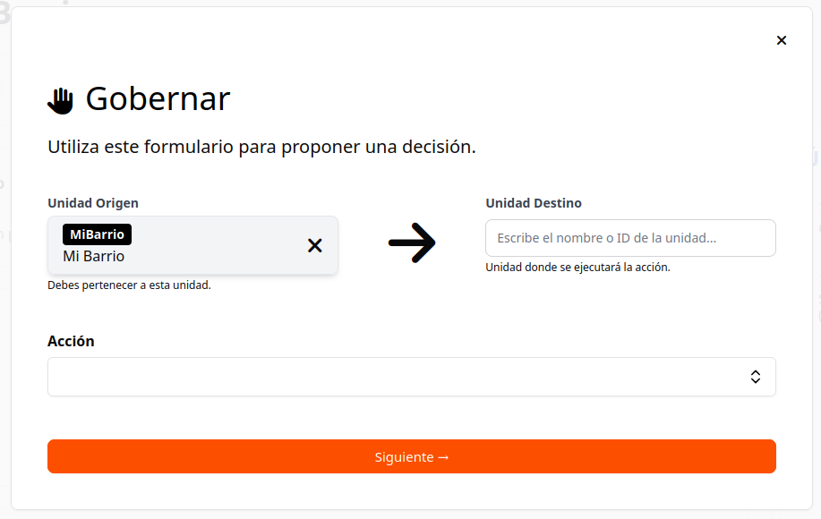

# Estructura Organizacional y Navegación

Una vez iniciada la sesión, se pueden realizar acciones individuales y colectivas usando el menú izquierdo; para facilitar el uso del sistema se tiene un botón de acceso rápido para iniciar propuestas.

Al presionar el botón Gobernar, se abre el siguiente formulario:

Se deben seleccionar la Unidad de Origen (donde sale la propuesta) y la Unidad Destino (donde se realiza la propuesta).

En el listado de Acción debe seleccionar una actividad según el tipo de propuesta que considere realizar.

Las Acciones posibles son:
  *Iniciar membresía
  *Crear unidad organizacional
  *Promover membresía
  *Asignar rol
  *Designar rol
  *Archivar rol

## **1. ¿Cómo se crea un nuevo integrante?**

Una vez que hayas presionado el botón gobernar, ingreses la unidad de origen y destino, selecciona la Acción “Iniciar membresía”.

## **2. ¿Cómo se crea una nueva organización?**
## **3. ¿Cómo asignar personas a una organización?**
## **4. ¿Cómo crear roles?
## **5. ¿Cómo asignar tareas?
