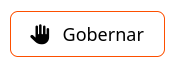
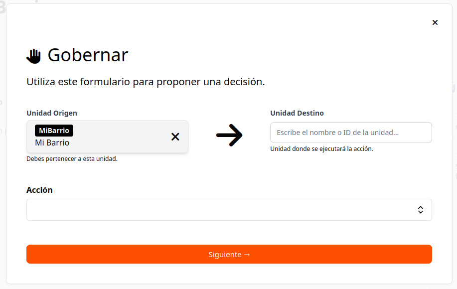
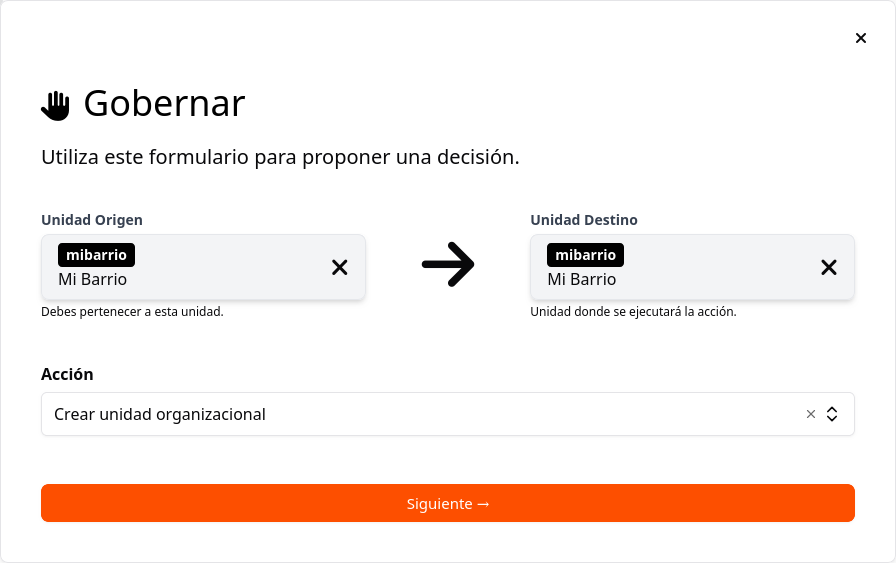
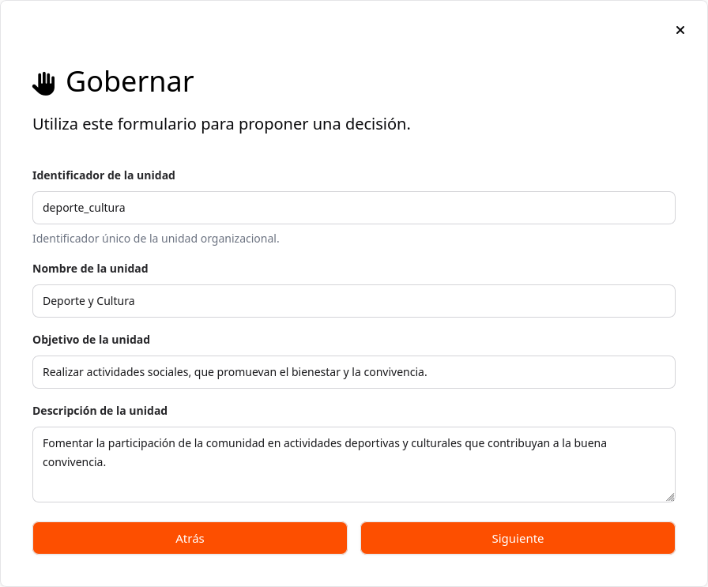
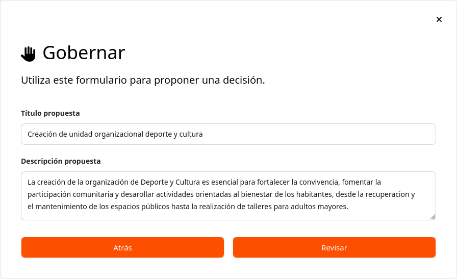
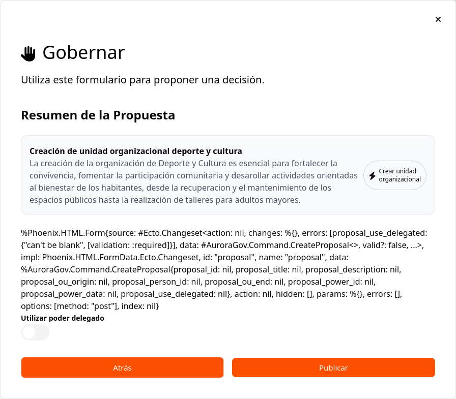
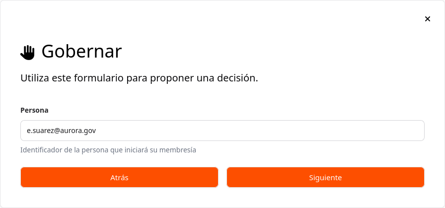
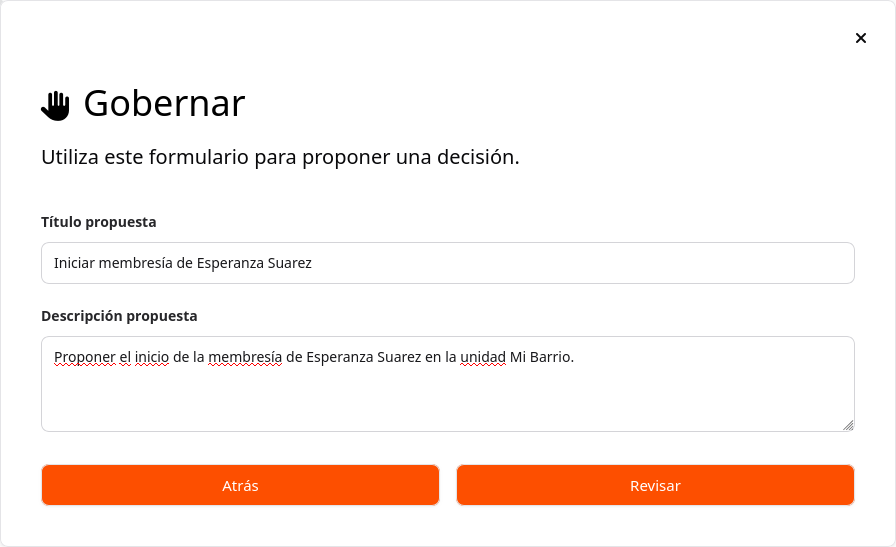
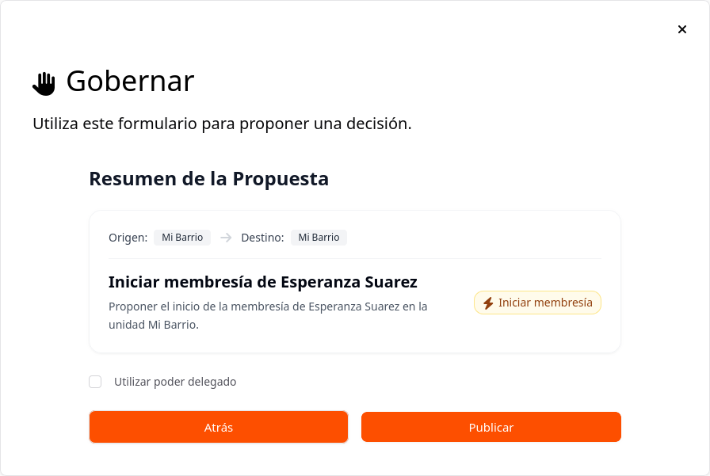

# Estructura Organizacional y Navegación

Una vez iniciada la sesión, se pueden realizar acciones individuales y colectivas usando el menú izquierdo; para facilitar el uso del sistema se tiene un botón de acceso rápido para iniciar propuestas.

Al presionar el botón Gobernar, se abre el siguiente formulario:

Se deben seleccionar la Unidad de Origen (donde sale la propuesta) y la Unidad Destino (donde se realiza la propuesta).

En el listado de Acción debe seleccionar una actividad según el tipo de propuesta que considere realizar.

Las Acciones posibles son:
   * Iniciar membresía
   * Crear unidad organizacional
   * Promover membresía
   * Asignar rol
   * Designar rol
   * Archivar rol

  <strong>📘 ¿Cómo crear una unidad organizacional?</strong> 
  <small><em>Haz clic para ver las instrucciones.</em></small>

Seleccione la **Unidad de Origen** (desde donde se presenta la propuesta) y la **Unidad Destino** (donde se ejecutará la decisión).

En el campo **Acción**, seleccione **Crear unidad organizacional** y haga clic en **Siguiente**.

A continuación, le mostrará el formulario para registrar la información de la nueva unidad organizacional.

Complete los siguientes campos:
   * **Identificador de la unidad:** identificador único de la unidad organizacional.
   * **Nombre de la unidad:** nombre con el que se identificará la unidad.
   * **Objetivo de la unidad:** propósito o finalidad de la unidad organizacional.
   * **Descripción de la unidad:** información adicional que describa las funciones o características de la unidad.

Una vez completada la información de la unidad organizacional, haga clic en **Siguiente**.

Se mostrará el formulario para registrar la propuesta de creación de la unidad organizacional. En este formulario deberá ingresar:

   * **Título de la propuesta.**
   * **Descripción de la propuesta.**

Después de completar la información, haga clic en **Revisar**.

Se mostrará un resumen con toda la información de la propuesta para que pueda verificarla antes de enviarla a votación.

Si la información es correcta, haga clic en **Publicar** para presentar la propuesta a la comunidad.

Al publicar la propuesta, el sistema redirige automáticamente a la pantalla de **Propuestas**, donde se muestran las propuestas activas que requieren la participación de los miembros.

En el costado derecho de la pantalla encontrará tres pestañas que permiten consultar y participar en la propuesta:

   * **Información:** presenta los datos generales de la propuesta.
   * **Estado:** muestra el estado de la votación y, cuando corresponda, permite promulgar la decisión.
   * **Discusión:** permite consultar los argumentos registrados por los participantes y emitir el voto sobre la propuesta.

  <strong>📘 ¿Cómo iniciar una membresía?</strong> 
  <small><em>Haz clic para ver las instrucciones.</em></small>

Seleccione la **Unidad de Origen** (desde donde se presenta la propuesta) y la **Unidad Destino** (donde se iniciará la membresía).

En el campo **Acción**, seleccione **Iniciar membresía** y haga clic en **Siguiente**.

A continuación, se solicitará el identificador de la persona que iniciará la membresía.

En el campo **Persona**, ingrese el **identificador de la persona** que desea incorporar a la unidad organizacional.

Una vez ingresado el identificador, haga clic en **Siguiente** para continuar.

A continuación, se solicitará la información de la propuesta.

En el campo **Título propuesta**, ingrese un título breve que permita identificar fácilmente la decisión que se está proponiendo.

En **Descripción propuesta**, explique brevemente el propósito de la propuesta y la acción que se desea realizar.

Una vez completada la información, haga clic en **Revisar** para continuar.

Se mostrará un **resumen de la propuesta** con la información que se ingresó en los pasos anteriores. Verifique que los datos de origen, destino, persona y descripción sean correctos.

Si la información es correcta, haga clic en **Publicar** para presentar la propuesta a la decisión de la comunidad.

También se muestra la opción **Utilizar poder delegado**, que permite realizar la propuesta mediante un poder delegado cuando corresponda.

