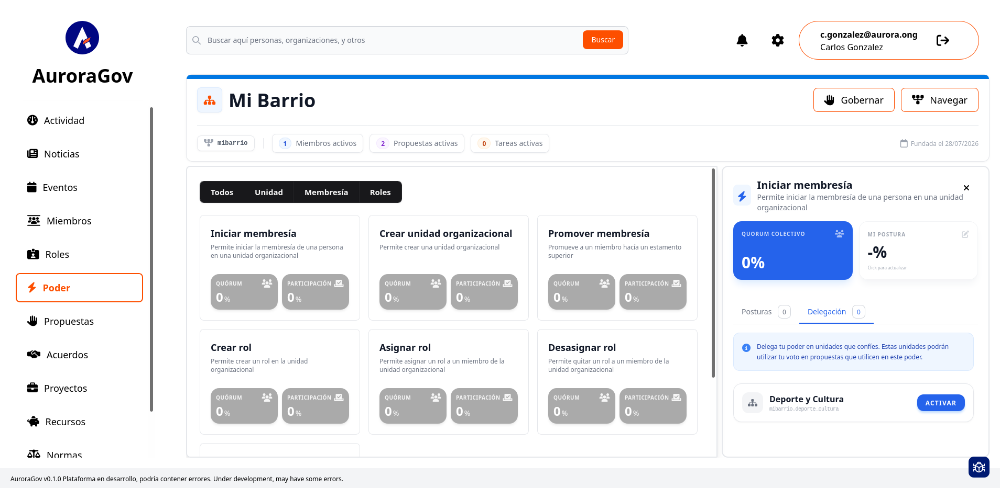
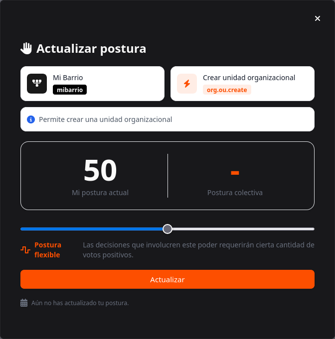
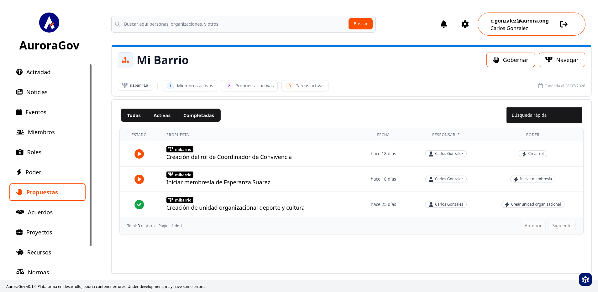

# Participación y Decisiones

En AuroraGov la toma de decisiones no depende de una sola persona, sino de la construcción colectiva de consensos. Esta sección explica cómo configurar tus preferencias de voto, delegar facultades y participar en las propuestas del colectivo.

---

## 1. Configuración de Poderes y Posturas

Antes de votar en propuestas concretas, cada miembro define su grado de exigencia o respaldo para las diferentes acciones de la organización.

* **Sección Poderes:** Muestra el listado de acciones gobernables (ej. *Iniciar membresía*, *Crear unidad organizacional*, *Crear rol*).
* **Configuración de "Mi Postura":** Al seleccionar una tarjeta de poder, en el panel lateral derecho haz clic en la caja **MI POSTURA** (o en el icono de edición) para abrir la ventana modal **Actualizar postura**.
* **Uso del Deslizador:** Dentro del modal, ajusta la barra deslizable (0% a 100%) según el porcentaje mínimo de aprobación que exiges para validar esa acción:
  * **0% - 49% (Postura flexible):** Exiges poco consenso; facilitas la aprobación de la acción.
  * **50% (Postura neutra):** Exiges mayoría simple.
  * **51% - 100% (Postura estricta):** Exiges un consenso amplio o cualificado para aprobar.
* **Cálculo del Quórum Colectivo:** Al hacer clic en **Actualizar**, tu valor individual aporta al cálculo del promedio de las posturas de todos los miembros activos (**Postura colectiva**). Este porcentaje final determina el Quórum necesario para aprobar futuras propuestas sobre dicho poder.

---

## 2. Delegación de Voto

Si no puedes estar al tanto de todas las decisiones o confías en el criterio de una subunidad, puedes ceder tu capacidad de voto.

1. Selecciona la acción sobre la cual deseas delegar tu voto (*Iniciar membresía*, *Crear unidad organizacional*, etc.).
2. En el panel lateral derecho, ingresa a la pestaña **Delegación**.
3. Ubica la unidad organizacional de confianza (ej. *Deporte y Cultura*) y haz clic en el botón **ACTIVAR**.

* **Impacto:** La unidad seleccionada usará tu voto en las propuestas agrupadas bajo ese poder específico.
* **Control:** Puedes revocar la delegación en cualquier momento haciendo clic en **DESACTIVAR** para recuperar el control directo de tu postura.

---

## 3. Flujo de Propuestas y Votación

Una vez configurados los parámetros colectivos, el proceso de decisión para una propuesta sigue este ciclo:

1. **Creación de Propuesta:** Un miembro redacta una solicitud formal vinculada a un poder específico.
2. **Revisión de Quórum:** La propuesta adopta automáticamente el porcentaje de aprobación definido previamente por la postura colectiva.
3. **Emisión de Voto:** Cada usuario (o su delegado) ingresa al módulo **Propuestas** y emite su voto (A favor / En contra / Abstención).
4. **Cierre y Ejecución:** Cuando se alcanzada la participación necesaria, si los votos afirmativos igualan o superan el quórum colectivo, la acción puede ser promulgada.

