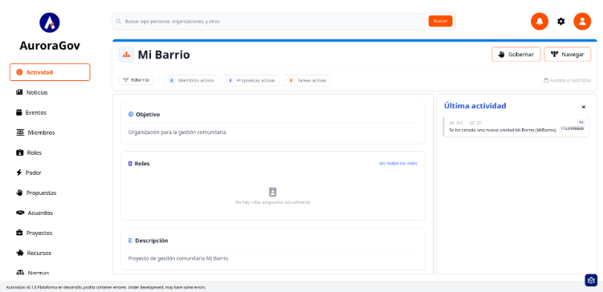

# Primeros pasos en Aurora Gov

1. En el navegador web, ingresa a la URL de *Aurora Gov* (ejemplo: `http://localhost:4000/`).
2. Ingresa la información en el formulario de inicio para crear la primera organización y los primeros integrantes.
3. **Exploración de la interfaz:** La pantalla principal contiene:
   * Menú lateral izquierdo.
   * Panel central con información de la organización.
   * Barra superior de búsqueda.
   * Panel de actividad reciente en el costado derecho.
     

4. **Inicio de sesión:** Para interactuar con el sistema, presiona el icono superior derecho de inicio de sesión e ingresa tu usuario y contraseña.
